### Questions

### Objectives
YWBAT
* compare and contrast the various methods for SVMs
* implement SVMs using sklearn
* use model analysis to tailor SVM

### Outline
- Introduce dataset
- Go through various svm models and their use case
- Tweak SVMs to suit the problem


```python
import pandas as pd
import numpy as np

from sklearn.datasets import make_circles,  make_blobs, make_moons
from sklearn.svm import SVC, LinearSVC, NuSVC
from sklearn.metrics import confusion_matrix, precision_recall_fscore_support, accuracy_score, classification_report
from sklearn.model_selection import train_test_split
from mlxtend.plotting import plot_decision_regions

import matplotlib.pyplot as plt
import seaborn as sns
```


```python
def plot_groups(x, y):
    plt.figure(figsize=(8, 8))
    plt.grid(linestyle='dashed')
    color_dict = {0: 'g', 1: 'purple'}
    for data, label in zip(x, y):
        plt.scatter(data[0], data[1], c=color_dict[label], alpha=0.5, s=60)
    plt.xlabel("X1")
    plt.ylabel("X2")
    plt.show()
    

def plot_groups3(x, y):
    plt.figure(figsize=(8, 8))
    plt.grid(linestyle='dashed')
    color_dict = {0: 'g', 1: 'purple', 2: 'yellow'}
    for data, label in zip(x, y):
        plt.scatter(data[0], data[1], c=color_dict[label], alpha=0.5, s=60)
    plt.xlabel("X1")
    plt.ylabel("X2")
    plt.show()
    

    
def plot_svm_groups(x, y, clf):
    plt.figure(figsize=(8, 5))
    plt.grid()
    plot_decision_regions(x, y, clf, colors='green,purple,yellow', scatter_kwargs={"s": 100, "alpha": 0.5})
    plt.xlabel("X1")
    plt.ylabel("X2")
    plt.title("SVM Decision Boundary")
    plt.show()
    

def print_report(ytrain, ytest, ytrain_pred, ytest_pred):
    report = classification_report(ytrain, ytrain_pred)
    print("Train Scores\n" + "-"*50)
    print(report)
    accuracy = accuracy_score(ytrain, ytrain_pred)
    print(f"Train Accuracy: {accuracy}")
    report = classification_report(ytest, ytest_pred)
    print("Test Scores\n" + "-"*50)
    print(report)
    accuracy = accuracy_score(ytest, ytest_pred)
    print(f"Test Accuracy: {accuracy}")
```

## Linear SVM
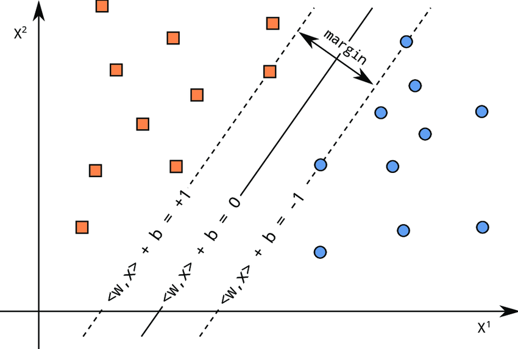


```python
x, y = make_blobs(n_samples=2000, n_features=2, centers=2, cluster_std=4.5)
```


```python
plot_groups(x, y)
```


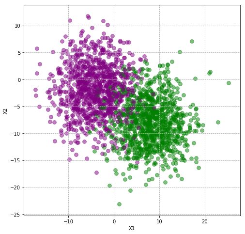


```python
xtrain, xtest, ytrain, ytest = train_test_split(x, y)
```


```python
clf = LinearSVC()
clf.fit(xtrain, ytrain)
```

    /anaconda3/lib/python3.7/site-packages/sklearn/svm/base.py:929: ConvergenceWarning: Liblinear failed to converge, increase the number of iterations.
      "the number of iterations.", ConvergenceWarning)


    LinearSVC(C=1.0, class_weight=None, dual=True, fit_intercept=True,
              intercept_scaling=1, loss='squared_hinge', max_iter=1000,
              multi_class='ovr', penalty='l2', random_state=None, tol=0.0001,
              verbose=0)


```python
plot_svm_groups(x, y, clf)
```


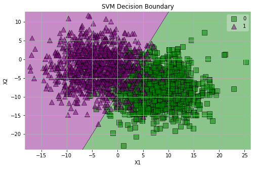


```python
ytrain_pred = clf.predict(xtrain)
ytest_pred = clf.predict(xtest)
```


```python
print_report(ytrain, ytest, ytrain_pred, ytest_pred)
```

    Train Scores
    --------------------------------------------------
                  precision    recall  f1-score   support
    
               0       0.93      0.93      0.93       745
               1       0.93      0.94      0.93       755
    
        accuracy                           0.93      1500
       macro avg       0.93      0.93      0.93      1500
    weighted avg       0.93      0.93      0.93      1500
    
    Train Accuracy: 0.9333333333333333
    Test Scores
    --------------------------------------------------
                  precision    recall  f1-score   support
    
               0       0.95      0.95      0.95       255
               1       0.95      0.95      0.95       245
    
        accuracy                           0.95       500
       macro avg       0.95      0.95      0.95       500
    weighted avg       0.95      0.95      0.95       500
    
    Test Accuracy: 0.95


### Thoughts

## RBF SVM


```python
x, y = make_circles(n_samples=2000, shuffle=True, noise=0.05)
```


```python
plot_groups(x, y)
```


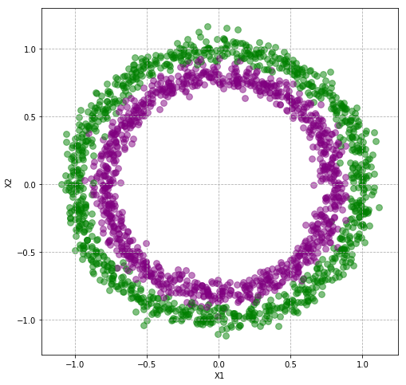


```python
xtrain, xtest, ytrain, ytest = train_test_split(x, y)
```

### Linear SVM


```python
clf = LinearSVC()
clf.fit(xtrain, ytrain)
ytrain_pred = clf.predict(xtrain)
ytest_pred = clf.predict(xtest)
plot_svm_groups(x, y, clf)
print_report(ytrain, ytest, ytrain_pred, ytest_pred)
```


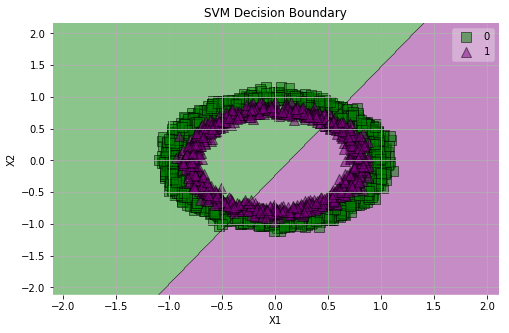


    Train Scores
    --------------------------------------------------
                  precision    recall  f1-score   support
    
               0       0.50      0.55      0.52       751
               1       0.50      0.45      0.47       749
    
        accuracy                           0.50      1500
       macro avg       0.50      0.50      0.50      1500
    weighted avg       0.50      0.50      0.50      1500
    
    Train Accuracy: 0.49933333333333335
    Test Scores
    --------------------------------------------------
                  precision    recall  f1-score   support
    
               0       0.48      0.52      0.50       249
               1       0.48      0.45      0.46       251
    
        accuracy                           0.48       500
       macro avg       0.48      0.48      0.48       500
    weighted avg       0.48      0.48      0.48       500
    
    Test Accuracy: 0.484


### RBF


```python
clf = SVC(kernel='rbf')
clf.fit(xtrain, ytrain)
ytrain_pred = clf.predict(xtrain)
ytest_pred = clf.predict(xtest)
plot_svm_groups(x, y, clf)
print_report(ytrain, ytest, ytrain_pred, ytest_pred)
```

    /anaconda3/lib/python3.7/site-packages/sklearn/svm/base.py:193: FutureWarning: The default value of gamma will change from 'auto' to 'scale' in version 0.22 to account better for unscaled features. Set gamma explicitly to 'auto' or 'scale' to avoid this warning.
      "avoid this warning.", FutureWarning)


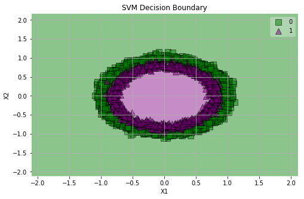


    Train Scores
    --------------------------------------------------
                  precision    recall  f1-score   support
    
               0       0.97      0.98      0.98       751
               1       0.98      0.97      0.98       749
    
        accuracy                           0.98      1500
       macro avg       0.98      0.98      0.98      1500
    weighted avg       0.98      0.98      0.98      1500
    
    Train Accuracy: 0.9786666666666667
    Test Scores
    --------------------------------------------------
                  precision    recall  f1-score   support
    
               0       0.95      0.99      0.97       249
               1       0.99      0.95      0.97       251
    
        accuracy                           0.97       500
       macro avg       0.97      0.97      0.97       500
    weighted avg       0.97      0.97      0.97       500
    
    Test Accuracy: 0.97


### Thoughts

## Sigmoidal SVM


```python
x, y = make_moons(n_samples=2000, noise=0.10)
```


```python
plot_groups(x, y)
```


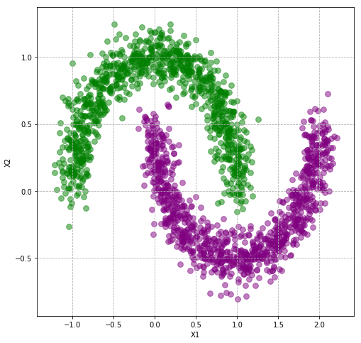


```python
xtrain, xtest, ytrain, ytest = train_test_split(x, y)
```


```python
clf = SVC(kernel='sigmoid')
clf.fit(xtrain, ytrain)
ytrain_pred = clf.predict(xtrain)
ytest_pred = clf.predict(xtest)
plot_svm_groups(x, y, clf)
print_report(ytrain, ytest, ytrain_pred, ytest_pred)
```

    /anaconda3/lib/python3.7/site-packages/sklearn/svm/base.py:193: FutureWarning: The default value of gamma will change from 'auto' to 'scale' in version 0.22 to account better for unscaled features. Set gamma explicitly to 'auto' or 'scale' to avoid this warning.
      "avoid this warning.", FutureWarning)


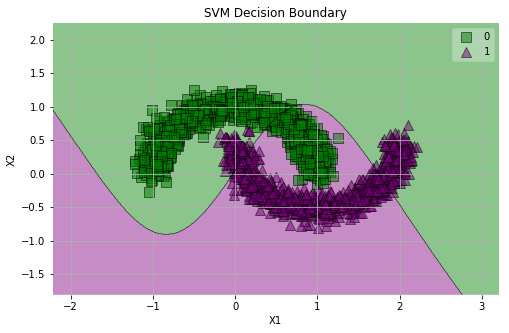


    Train Scores
    --------------------------------------------------
                  precision    recall  f1-score   support
    
               0       0.68      0.68      0.68       739
               1       0.69      0.69      0.69       761
    
        accuracy                           0.68      1500
       macro avg       0.68      0.68      0.68      1500
    weighted avg       0.68      0.68      0.68      1500
    
    Train Accuracy: 0.6833333333333333
    Test Scores
    --------------------------------------------------
                  precision    recall  f1-score   support
    
               0       0.71      0.70      0.71       261
               1       0.68      0.69      0.68       239
    
        accuracy                           0.70       500
       macro avg       0.70      0.70      0.70       500
    weighted avg       0.70      0.70      0.70       500
    
    Test Accuracy: 0.696


### RBF


```python
clf = SVC(kernel='rbf')
clf.fit(xtrain, ytrain)
ytrain_pred = clf.predict(xtrain)
ytest_pred = clf.predict(xtest)
plot_svm_groups(x, y, clf)
print_report(ytrain, ytest, ytrain_pred, ytest_pred)
```

    /anaconda3/lib/python3.7/site-packages/sklearn/svm/base.py:193: FutureWarning: The default value of gamma will change from 'auto' to 'scale' in version 0.22 to account better for unscaled features. Set gamma explicitly to 'auto' or 'scale' to avoid this warning.
      "avoid this warning.", FutureWarning)


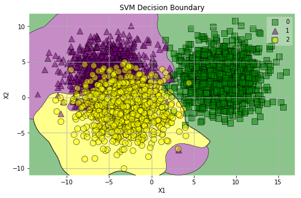


    Train Scores
    --------------------------------------------------
                  precision    recall  f1-score   support
    
               0       1.00      0.99      0.99       727
               1       0.84      0.83      0.83       769
               2       0.82      0.84      0.83       754
    
        accuracy                           0.88      2250
       macro avg       0.89      0.89      0.89      2250
    weighted avg       0.88      0.88      0.88      2250
    
    Train Accuracy: 0.8835555555555555
    Test Scores
    --------------------------------------------------
                  precision    recall  f1-score   support
    
               0       0.99      0.99      0.99       273
               1       0.87      0.83      0.85       231
               2       0.84      0.88      0.86       246
    
        accuracy                           0.90       750
       macro avg       0.90      0.90      0.90       750
    weighted avg       0.90      0.90      0.90       750
    
    Test Accuracy: 0.9026666666666666


### Linear


```python
clf = LinearSVC()
clf.fit(xtrain, ytrain)
ytrain_pred = clf.predict(xtrain)
ytest_pred = clf.predict(xtest)
plot_svm_groups(x, y, clf)
print_report(ytrain, ytest, ytrain_pred, ytest_pred)
```


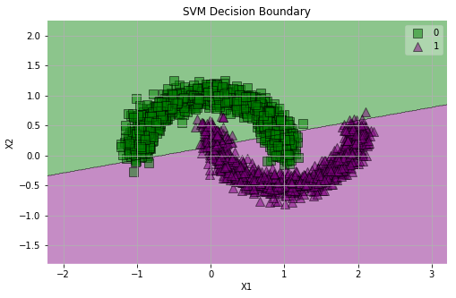


    Train Scores
    --------------------------------------------------
                  precision    recall  f1-score   support
    
               0       0.88      0.88      0.88       739
               1       0.88      0.88      0.88       761
    
        accuracy                           0.88      1500
       macro avg       0.88      0.88      0.88      1500
    weighted avg       0.88      0.88      0.88      1500
    
    Train Accuracy: 0.8806666666666667
    Test Scores
    --------------------------------------------------
                  precision    recall  f1-score   support
    
               0       0.88      0.89      0.89       261
               1       0.88      0.87      0.87       239
    
        accuracy                           0.88       500
       macro avg       0.88      0.88      0.88       500
    weighted avg       0.88      0.88      0.88       500
    
    Test Accuracy: 0.88


## Polynomial SVM


```python
clf = SVC(kernel='poly')
clf.fit(xtrain, ytrain)
ytrain_pred = clf.predict(xtrain)
ytest_pred = clf.predict(xtest)
plot_svm_groups(x, y, clf)
print_report(ytrain, ytest, ytrain_pred, ytest_pred)
```

    /anaconda3/lib/python3.7/site-packages/sklearn/svm/base.py:193: FutureWarning: The default value of gamma will change from 'auto' to 'scale' in version 0.22 to account better for unscaled features. Set gamma explicitly to 'auto' or 'scale' to avoid this warning.
      "avoid this warning.", FutureWarning)


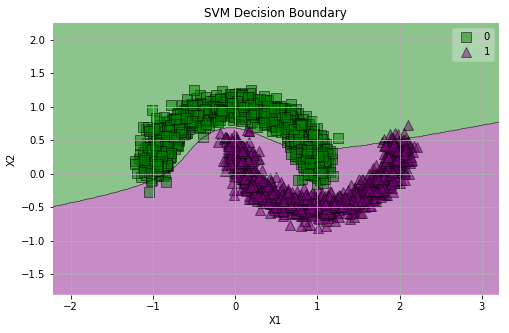


    Train Scores
    --------------------------------------------------
                  precision    recall  f1-score   support
    
               0       0.99      0.87      0.92       739
               1       0.89      0.99      0.93       761
    
        accuracy                           0.93      1500
       macro avg       0.94      0.93      0.93      1500
    weighted avg       0.94      0.93      0.93      1500
    
    Train Accuracy: 0.93
    Test Scores
    --------------------------------------------------
                  precision    recall  f1-score   support
    
               0       0.99      0.89      0.94       261
               1       0.89      0.99      0.94       239
    
        accuracy                           0.94       500
       macro avg       0.94      0.94      0.94       500
    weighted avg       0.94      0.94      0.94       500
    
    Test Accuracy: 0.936


###  Thoughts?


```python
x, y = make_blobs(n_samples=3000, n_features=2, centers=3, cluster_std=2.5)
plot_groups3(x, y)
```


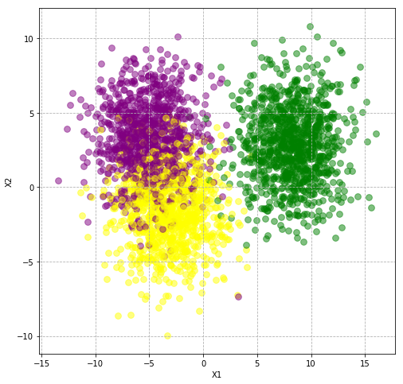


## Let's try all types of SVMs


```python
xtrain, xtest, ytrain, ytest = train_test_split(x, y)
```

### Linear


```python
clf = SVC(kernel='poly', degree=1)
clf.fit(xtrain, ytrain)
ytrain_pred = clf.predict(xtrain)
ytest_pred = clf.predict(xtest)
plot_svm_groups(x, y, clf)
print_report(ytrain, ytest, ytrain_pred, ytest_pred)
```

    /anaconda3/lib/python3.7/site-packages/sklearn/svm/base.py:193: FutureWarning: The default value of gamma will change from 'auto' to 'scale' in version 0.22 to account better for unscaled features. Set gamma explicitly to 'auto' or 'scale' to avoid this warning.
      "avoid this warning.", FutureWarning)


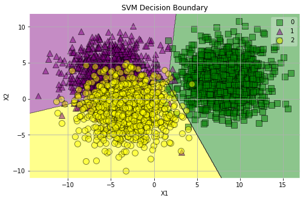


    Train Scores
    --------------------------------------------------
                  precision    recall  f1-score   support
    
               0       0.99      0.98      0.99       727
               1       0.83      0.82      0.82       769
               2       0.81      0.83      0.82       754
    
        accuracy                           0.87      2250
       macro avg       0.88      0.88      0.88      2250
    weighted avg       0.88      0.87      0.87      2250
    
    Train Accuracy: 0.8746666666666667
    Test Scores
    --------------------------------------------------
                  precision    recall  f1-score   support
    
               0       1.00      0.99      0.99       273
               1       0.89      0.84      0.86       231
               2       0.85      0.90      0.87       246
    
        accuracy                           0.91       750
       macro avg       0.91      0.91      0.91       750
    weighted avg       0.91      0.91      0.91       750
    
    Test Accuracy: 0.9133333333333333


### Polynomial (3)


```python
clf = SVC(kernel='poly', degree=3)
clf.fit(xtrain, ytrain)
ytrain_pred = clf.predict(xtrain)
ytest_pred = clf.predict(xtest)
plot_svm_groups(x, y, clf)
print_report(ytrain, ytest, ytrain_pred, ytest_pred)
```

    /anaconda3/lib/python3.7/site-packages/sklearn/svm/base.py:193: FutureWarning: The default value of gamma will change from 'auto' to 'scale' in version 0.22 to account better for unscaled features. Set gamma explicitly to 'auto' or 'scale' to avoid this warning.
      "avoid this warning.", FutureWarning)


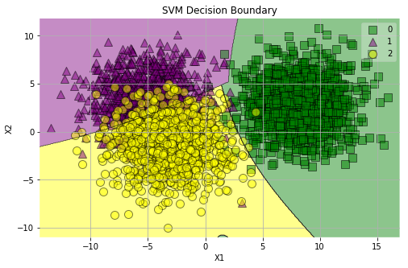


    Train Scores
    --------------------------------------------------
                  precision    recall  f1-score   support
    
               0       0.99      0.98      0.99       727
               1       0.90      0.69      0.78       769
               2       0.74      0.92      0.82       754
    
        accuracy                           0.86      2250
       macro avg       0.88      0.87      0.86      2250
    weighted avg       0.88      0.86      0.86      2250
    
    Train Accuracy: 0.8631111111111112
    Test Scores
    --------------------------------------------------
                  precision    recall  f1-score   support
    
               0       1.00      0.99      0.99       273
               1       0.96      0.75      0.84       231
               2       0.80      0.96      0.87       246
    
        accuracy                           0.91       750
       macro avg       0.92      0.90      0.90       750
    weighted avg       0.92      0.91      0.91       750
    
    Test Accuracy: 0.908


### RBF


```python
clf = SVC(kernel='rbf')
clf.fit(xtrain, ytrain)
ytrain_pred = clf.predict(xtrain)
ytest_pred = clf.predict(xtest)
plot_svm_groups(x, y, clf)
print_report(ytrain, ytest, ytrain_pred, ytest_pred)
```

    /anaconda3/lib/python3.7/site-packages/sklearn/svm/base.py:193: FutureWarning: The default value of gamma will change from 'auto' to 'scale' in version 0.22 to account better for unscaled features. Set gamma explicitly to 'auto' or 'scale' to avoid this warning.
      "avoid this warning.", FutureWarning)


    Train Scores
    --------------------------------------------------
                  precision    recall  f1-score   support
    
               0       1.00      0.99      0.99       727
               1       0.84      0.83      0.83       769
               2       0.82      0.84      0.83       754
    
        accuracy                           0.88      2250
       macro avg       0.89      0.89      0.89      2250
    weighted avg       0.88      0.88      0.88      2250
    
    Train Accuracy: 0.8835555555555555
    Test Scores
    --------------------------------------------------
                  precision    recall  f1-score   support
    
               0       0.99      0.99      0.99       273
               1       0.87      0.83      0.85       231
               2       0.84      0.88      0.86       246
    
        accuracy                           0.90       750
       macro avg       0.90      0.90      0.90       750
    weighted avg       0.90      0.90      0.90       750
    
    Test Accuracy: 0.9026666666666666


### Sigmoidal


```python
clf = SVC(kernel='sigmoid')
clf.fit(xtrain, ytrain)
ytrain_pred = clf.predict(xtrain)
ytest_pred = clf.predict(xtest)
plot_svm_groups(x, y, clf)
print_report(ytrain, ytest, ytrain_pred, ytest_pred)
```

    /anaconda3/lib/python3.7/site-packages/sklearn/svm/base.py:193: FutureWarning: The default value of gamma will change from 'auto' to 'scale' in version 0.22 to account better for unscaled features. Set gamma explicitly to 'auto' or 'scale' to avoid this warning.
      "avoid this warning.", FutureWarning)


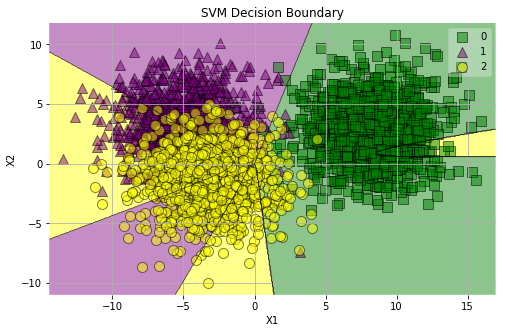


    Train Scores
    --------------------------------------------------
                  precision    recall  f1-score   support
    
               0       0.90      0.94      0.92       727
               1       0.55      0.55      0.55       769
               2       0.48      0.46      0.47       754
    
        accuracy                           0.65      2250
       macro avg       0.64      0.65      0.65      2250
    weighted avg       0.64      0.65      0.64      2250
    
    Train Accuracy: 0.6453333333333333
    Test Scores
    --------------------------------------------------
                  precision    recall  f1-score   support
    
               0       0.92      0.97      0.95       273
               1       0.53      0.52      0.52       231
               2       0.50      0.49      0.50       246
    
        accuracy                           0.67       750
       macro avg       0.65      0.66      0.66       750
    weighted avg       0.66      0.67      0.67       750
    
    Test Accuracy: 0.6733333333333333


### Assessment
